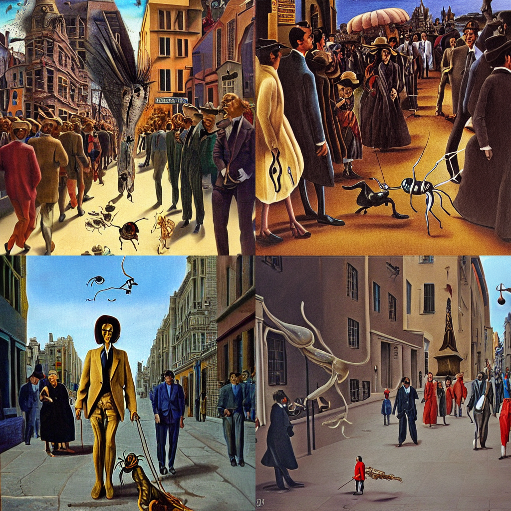
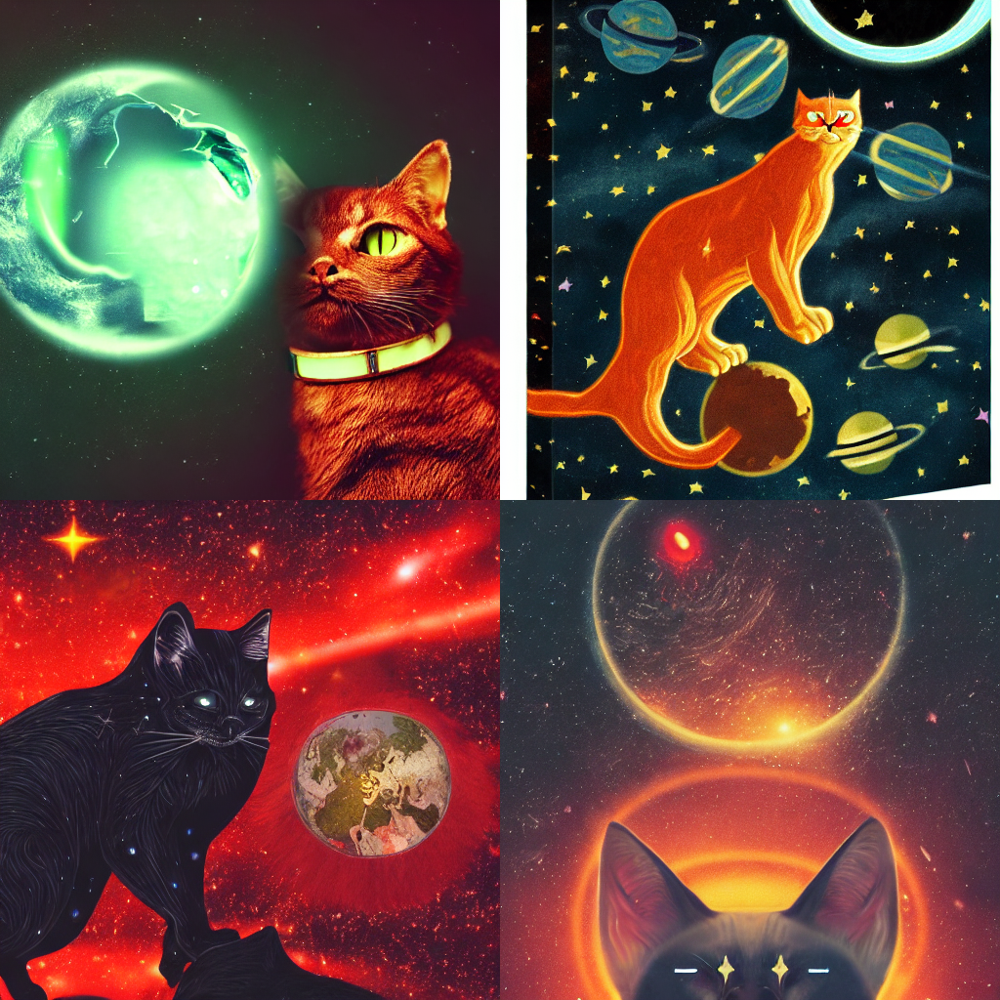
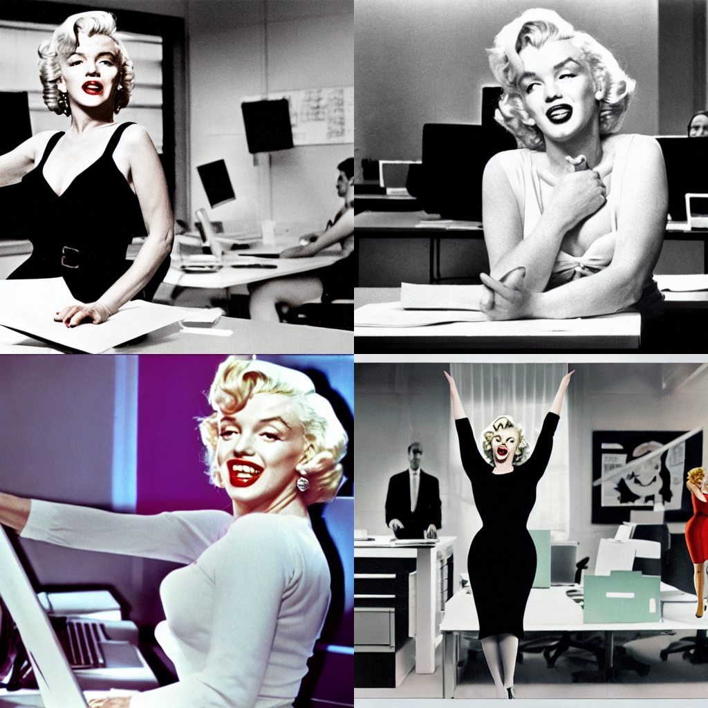
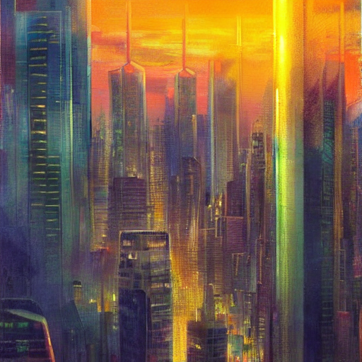

#  Домашнее задание №1

> [!IMPORTANT]
> [Ссылка на ДЗ Google Colab](https://colab.research.google.com/drive/1_0-dXyP2RiDErVBBy_D2lsqYKtWWbl_r?usp=sharing)
> :shipit:

> [!NOTE]
> Получился не совсем тот результат, который я ожидал. Понимаю, что проблема заключается в моих навыках написания промптов и в умении использовать различные вариации Stable Diffusion для достижения нужного уровня проработки изображений. Будем работать :)

## Результат:
```
createImagesStableDiffusion('Salvador Dali walks down the street with a cockroach on a leash, city, surrealism, crowded, people turn around, 8k, highly detailed, –ar 16:9 ', 2, 2, 100)
```

```
createImagesStableDiffusion('evil giant space cat eats planet Earth, dark background, red cats eyes, out of focus universe stars in the background, ultra‑details, 16K.', 2, 2, 100)
```

```
createImagesStableDiffusion('Marilyn Monroe dancing on an office desk, standing on one leg with arms raised, office workers watching her in surprise, office background with desks, computers, papers, bright colors, ultra-details, dynamic movement, highly realistic, 16K.', 2, 2, 200)
```

```
createImagesStableDiffusion('The carnivorous monstera plant gazes longingly at the incredibly beautiful hamster, with sad, wide eyes formed from its leaves, the hamster sits unaware, night jungle background, anime style, ultra-details, 16K.', 1, 1, 200)
```

```
createImagesStableDiffusion('A futuristic city skyline at sunset, where giant jellyfish float gracefully through the sky, reflecting the soft, glowing lights of the buildings below. People watch in awe from the streets, their forms blurred by movement and light, impressionist painting style, soft brushstrokes, dreamy colors, 16K.', 1, 1, 500)
```

